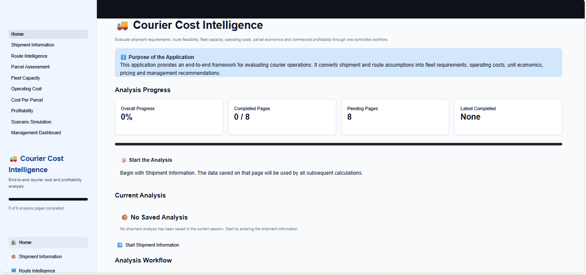

Status

🚧 Work in Progress – Core modules under active development.

Objective
Develop an end-to-end Streamlit application to simulate courier operating costs, cost per parcel and profitability under different logistics scenarios.

Current Features

✅ Shipment upload and validation
✅ Route intelligence
✅ Parcel assessment
✅ Fleet capacity planning
🚧 Operating cost calculation
🚧 Cost per parcel analysis
🚧 Profitability simulation
🚧 Executive dashboard

Technologies

Python
Streamlit
Pandas
OpenPyXL

Business Value
Supports logistics planning and data-driven decision-making through interactive cost and profitability analysis.

